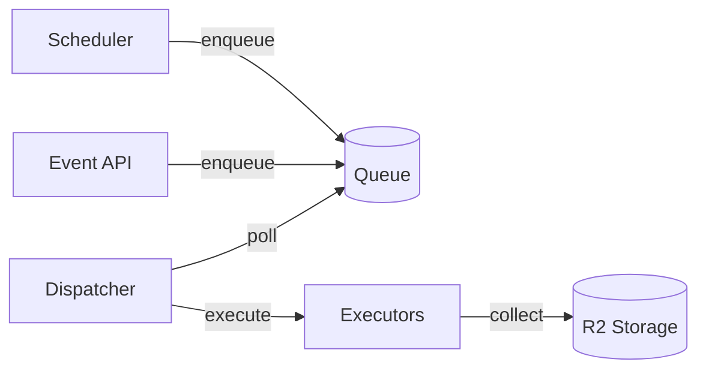

# Pipelines Service Architecture

データ収集・ETL/ELT パイプラインを実行する常駐サービスのドキュメント。

## 概要

このディレクトリには以下の構成要素のドキュメントがあります。

1. **Pipelines Service Architecture** ([architecture.md](./architecture.md)): サービス全体のアーキテクチャ
2. **Testing Strategy** ([testing-strategy.md](./testing-strategy.md)): テスト戦略とガイドライン
3. **各データソースの詳細設計**: Spotify, GitHub, Browser History など

---

## Pipelines Service Architecture

| No. | コンポーネント | 説明 |
|---|---|---|
| Scheduler | APScheduler でスケジュール管理 | CRON/INTERVAL トリガー |
| Dispatcher | キュー内の run を poll して実行 | workflow の順次実行 |
| Lock Manager | 排他制御 | 同時実行を制御 |
| Repository | 永続化 | SQLite で workflow/run/step 状態管理 |
| Executors | Step 実行 | inprocess / subprocess の2種類を提供 |

---

## アーキテクチャ全体像

詳細は [architecture.md](./architecture.md) を参照してください。

---

## データソース一覧

### 実装済み

| No. | データソース | ドキュメント | データタイプ | 優先度 |
|---|---|---|---|---|
| 01 | Spotify | [spotify.md](./spotify.md) | 構造化ログ | MVP |
| 02 | GitHub | [github.md](./github.md) | 構造化ログ | MVP |
| 03 | Browser History | [browser-history.md](./browser-history.md) | 時系列・行動履歴 | MVP |

### 実装予定

| No. | データソース | ドキュメント | データタイプ | 優先度 |
|---|---|---|---|---|
| 04 | Bank（銀行取引） | 未作成 | 構造化ログ | Phase 1 |
| 05 | Amazon（購買履歴） | 未作成 | 構造化ログ | Phase 1 |
| 06 | Calendar（カレンダー） | 未作成 | 構造化ログ | Phase 1 |
| 07 | Note（メモ） | 未作成 | 非構造化データ | Phase 2 |
| 08 | Email | 未作成 | 非構造化データ | Phase 2 |
| 09 | Location | 未作成 | 時系列・行動履歴 | Phase 3 |

---

## ドキュメント作成
新しいデータソースを追加する場合は、 [_template.md](./_template.md) を参照してください。
テンプレートには以下が含まれています：
- 必須/オプションセクションの構成
- 各セクションの記述ガイドライン
- 表形式の記述ルール
- 検証チェックリスト

---

## 優先度の定義

| 優先度 | 説明 | 実装タイミング |
|---|---|---|
| **MVP** | 最初に実装する最小構成 | Phase 1の開始時 |
| **Phase 1** | 基本的な構造化データ | MVPの次 |
| **Phase 2** | 非構造化データの追加 | Phase 1完了後 |
| **Phase 3** | 高度な機能（要約・時系列) | Phase 2完了後 |

---

## 参考
- [データ戦略](../01-overview/data-strategy.md)
- [システムアーキテクチャ](../01-overview/system-architecture.md)
- [テスト戦略](./testing-strategy.md)
END-of-file
