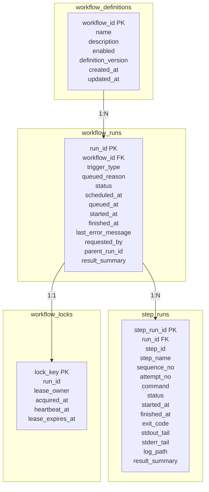
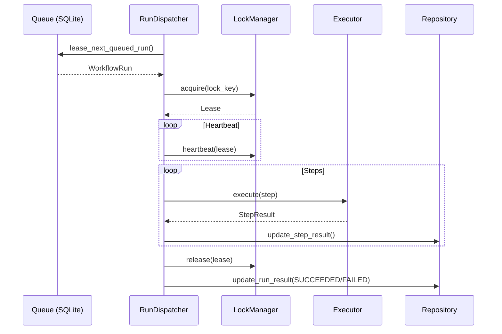
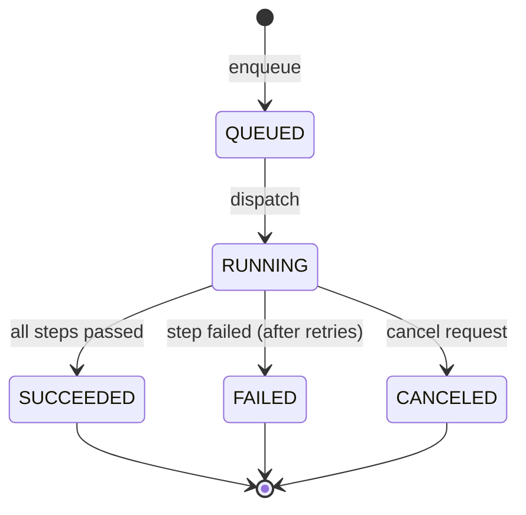
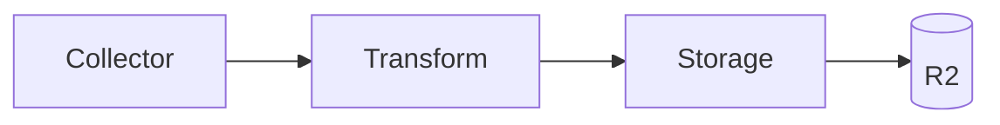
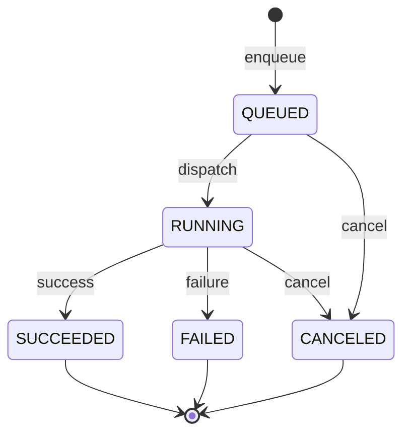
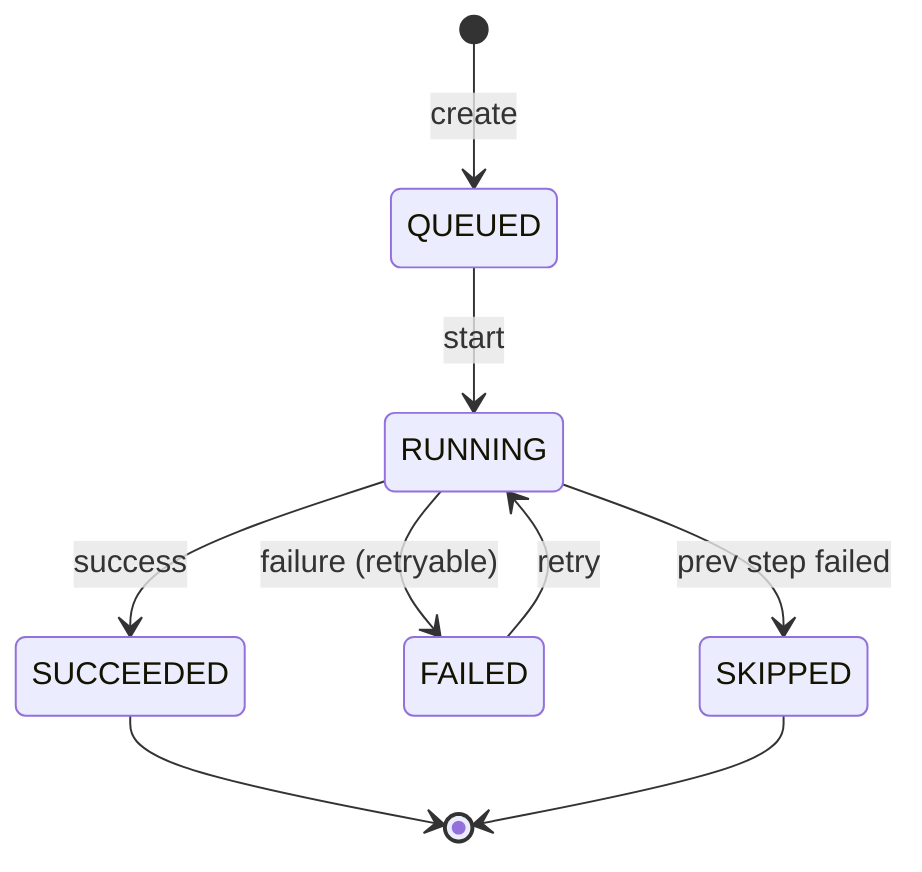

# Pipelines Service Architecture

データ収集・ETL/ELT パイプラインを実行する常駐サービスのアーキテクチャ詳細。

## 概要

Pipelines Service は、スケジュール駆動またはイベント駆動でデータ収集ワークフローを実行する常駐サービスである。

主な責務:
- **Schedule Trigger**: CRON / INTERVAL で定期実行
- **Run Dispatch**: キュー内の run を順次処理
- **Step Execution**: inprocess / subprocess でステップを実行
- **State Management**: SQLite で run/step/lock を永続化

---

## アーキテクチャ全体像

```mermaid
flowchart TB
    subgraph External
        A[Chrome Extension]
        B[GitHub API]
        C[Spotify API]
        D[Google Takeout]
    end

    subgraph "Pipelines Service"
        subgraph "Trigger Layer"
            S[APScheduler<br/>CRON/INTERVAL]
            E[Event API<br/>POST /v1/ingest/*]
        end

        subgraph "Queue Layer"
            Q[(SQLite)<br/>workflow_runs]
        end

        subgraph "Dispatch Layer"
            DR[RunDispatcher<br/>poll & dispatch]
            L[LockManager<br/>concurrency control]
        end

        subgraph "Execution Layer"
            X1[InProcessExecutor]
            X2[SubprocessExecutor]
        end

        subgraph "Source Layer"
            GH[github/]
            SP[spotify/]
            BH[browser_history/]
            GA[google_activity/]
            LM[local_mirror_sync/]
        end
    end

    subgraph Storage
        R2[(Cloudflare R2)<br/>raw/events/state]
    end

    S -->|enqueue| Q
    E -->|enqueue| Q
    DR -->|poll| Q
    DR --> L
    DR --> X1
    DR --> X2
    X1 --> GH
    X1 --> SP
    X1 --> BH
    X1 --> GA
    X1 --> LM
    GH --> R2
    SP --> R2
    BH --> R2
    GA --> R2
    LM --> R2
```

---

## コンポーネント詳細

### 1. Trigger Layer

#### 1.1 Scheduler (APScheduler)

```mermaid
flowchart LR
    subgraph "ScheduleTriggerApp"
        R[Registry<br/>workflow definitions]
        D[(SQLite)<br/>schedules]
        A[APScheduler<br/>BackgroundScheduler]
    end

    R -->|sync_jobs| A
    A -->|tick| E[enqueue_run]
    E --> D
```

**責務**: CRON / INTERVAL トリガーで `workflow_runs` へ run を enqueue

**実装**: APScheduler `BackgroundScheduler`

**Misfire Policy**:
- `COALESCE_LATEST`: 複数ミスファイアを1つにまとめる
- `SKIP_MISFIRE`: ミスファイアをスキップ

**Startup Reconcile**: サービス起動時に未実行のスケジュールを検出して enqueue

#### 1.2 Event API

- **Endpoint**: `POST /v1/ingest/browser-history`
- **用途**: 外部イベント（Browser Extension 等）からのリアルタイム取り込み
- **処理**: データ受信 → 検証 → Transform → enqueue compact workflow

---

### 2. Queue Layer

#### 2.1 SQLite Schema



---

### 3. Dispatch Layer

#### 3.1 RunDispatcher



**責務**: queued run を poll して workflow step を順次実行

**主要機能**:
- `dispatch_once()`: キューから1件取得して実行
- `run_forever()`: 停止要求まで poll を継続
- Heartbeat: 実行中の lock を定期更新

#### 3.2 LockManager

**責務**: workflow 単位の排他制御

**機能**:
- `acquire()`: lock 取得（失敗時は `WorkflowLockUnavailableError`）
- `heartbeat()`: lock 更新
- `release()`: lock 解放
- `cleanup_stale_locks()`: 古い lock のクリーンアップ

**Lock のライフサイクル**:
1. run 開始時に `acquire`
2. 実行中に `heartbeat` を定期的に送信
3. run 終了時に `release`

---

### 4. Execution Layer

#### 4.1 Executor Types

| Type | 用途 | 特徴 |
|---|---|---|
| **InProcessExecutor** | Python callable 実行 | 同一プロセス内で関数呼び出し |
| **SubprocessExecutor** | CLI コマンド実行 | 分離プロセスで実行、タイムアウト制御可能 |

#### 4.2 Step Definition

```python
@dataclass(frozen=True)
class StepDefinition:
    step_id: str                    # ステップ識別子
    step_name: str                  # 表示名
    executor_type: StepExecutorType  # inprocess / subprocess
    command: tuple[str, ...]        # subprocess の場合のコマンド
    callable_ref: str | None        # inprocess の場合の関数参照
    timeout_seconds: int = 1800    # タイムアウト
    max_attempts: int = 1            # 最大試行回数
    retry_delay_seconds: float = 0.0  # 再試行間隔
```

#### 4.3 Execution Flow



---

### 5. Source Layer

各データソースのパイプライン実装。

#### 5.1 共通パターン



| コンポーネント | 責務 |
|---|---|
| Collector | 外部 API からデータ取得 |
| Transform | 正規化・加工・Parquet 変換 |
| Storage | R2 へのアップロード |

#### 5.2 ディレクトリ構成

```
egograph/pipelines/sources/
├── browser_history/
│   ├── collector.py
│   ├── transform.py
│   ├── storage.py
│   ├── pipeline.py       # ingest / compact エントリーポイント
│   └── schema.py
├── github/
│   ├── collector.py
│   ├── transform.py
│   ├── storage.py
│   └── pipeline.py
├── spotify/
│   ├── collector.py
│   ├── transform.py
│   ├── storage.py
│   └── pipeline.py
└── common/
    ├── compaction.py
    ├── config.py
    └── utils.py
```

---

## Workflow 定義

### Workflow Definition

```python
@dataclass(frozen=True)
class WorkflowDefinition:
    workflow_id: str                      # ワークフロー識別子
    name: str                              # 表示名
    description: str                       # 説明
    steps: tuple[StepDefinition, ...]      # ステップ定義
    triggers: tuple[TriggerSpec, ...]      # トリガー定義
    enabled: bool = True                   # 有効フラグ
    definition_version: int = 1            # バージョン
    concurrency_key: str | None = None     # 排他制御キー
    timeout_seconds: int = 3600            # 全体タイムアウト
    misfire_policy: MisfirePolicy = COALESCE_LATEST
```

### Trigger Types

| Type | 記法 | 例 |
|---|---|---|
| **CRON** | 5フィールド cron | `0 15 * * *` (毎日 15:00 UTC) |
| **INTERVAL** | 数値+単位 | `6h` (6時間ごと) |

### 現在の Workflows

| Workflow | Schedule | Steps |
|---|---|---|
| `spotify_ingest_workflow` | 6回/日 (0,4,8,12,16,22 JST) | ingest → compact |
| `github_ingest_workflow` | 1回/日 (00:00 JST) | ingest → compact |
| `google_activity_ingest_workflow` | 1回/日 (23:00 JST) | ingest |
| `local_mirror_sync_workflow` | 6時間ごと | sync |
| `browser_history_compact_workflow` | イベント駆動 | compact |
| `browser_history_compact_maintenance_workflow` | 6時間ごと | compact maintenance |

---

## Run State Machine

### WorkflowRun Status



### StepRun Status



---

## エラーハンドリング

### エラー種別

| Error | 処理 |
|---|---|
| `WorkflowNotFoundError` | run を FAILED に設定 |
| `WorkflowLockUnavailableError` | run を requeue |
| `WorkflowDisabledError` | run を reject |
| Step timeout | FAILED として記録、再試行判定 |
| Step exception | FAILED として記録、再試行判定 |

### 再試行ロジック

```python
for attempt_no in range(1, step.max_attempts + 1):
    result = execute_step(step, attempt_no)
    if result.status == SUCCEEDED:
        return True
    if attempt_no < step.max_attempts:
        sleep(step.retry_delay_seconds)
return False
```

---

## 運用

### サービス起動・停止

```bash
# 起動
uv run python -m pipelines.main serve

# 停止 (SIGTERM で graceful shutdown)
```

### Startup 時の収束処理

1. **stale running runs**: 前回停止時に実行中だった run を FAILED に設定
2. **stale locks**: 古い lock を解放

### ログ

- **構造化ログ**: JSON 形式で `logs/` ディレクトリに出力
- **Step ログ**: 各 step の stdout/stderr を `logs/{workflow_id}/{run_id}/{step_id}.log` に保存

---

## API Endpoints

| Method | Path | 説明 |
|---|---|---|
| GET | `/v1/health` | ヘルスチェック |
| GET | `/v1/workflows` | ワークフロー一覧 |
| GET | `/v1/workflows/{id}` | ワークフロー詳細 |
| POST | `/v1/workflows/{id}/runs` | 手動実行 |
| POST | `/v1/workflows/{id}/enable` | 有効化 |
| POST | `/v1/workflows/{id}/disable` | 無効化 |
| GET | `/v1/runs` | run 一覧 |
| GET | `/v1/runs/{id}` | run 詳細 |
| POST | `/v1/runs/{id}/retry` | 再実行 |
| POST | `/v1/runs/{id}/cancel` | キャンセル |
| POST | `/v1/ingest/browser-history` | Browser History 受信 |

---

## 参考

- [Testing Strategy](./testing-strategy.md)
- [データ戦略](../01-overview/data-strategy.md)
