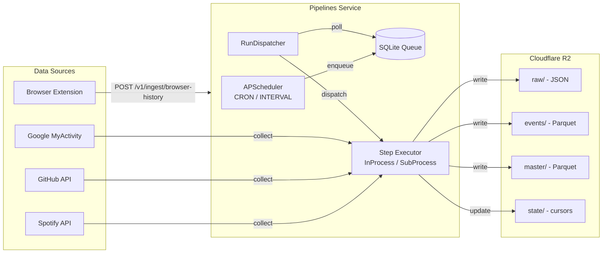
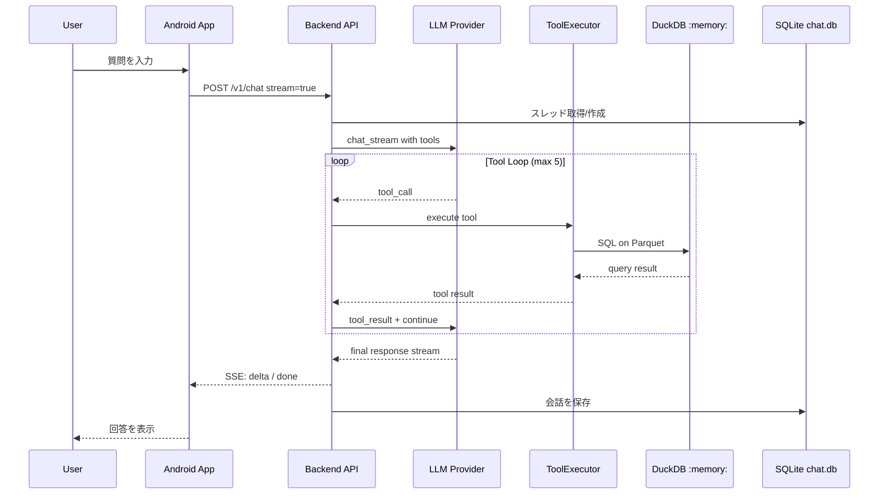
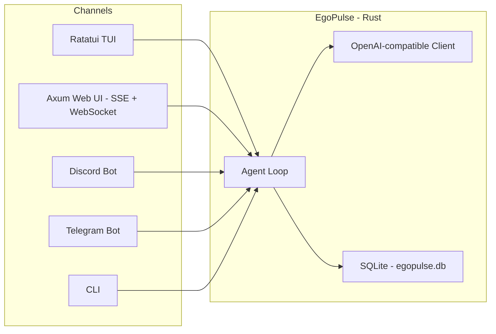

# システムアーキテクチャ

> 最終更新: 2026-04-05

## 1. システム概要

EgoGraphは、分散する個人データを統合し、AIエージェントを通じて自然言語で分析・対話できる基盤。**サーバーレス・ローカルファースト**を設計原則とする。

### 1.1 構成要素

| コンポーネント | 言語 | 責務 |
|---|---|---|
| **Pipelines Service** | Python 3.12+ | スケジュール駆動のデータ収集・ETL |
| **Backend (Agent API)** | Python 3.12+ | LLMエージェント + データアクセスREST API |
| **Frontend (Mobile App)** | Kotlin Multiplatform | Android ネイティブチャットUI |
| **EgoPulse** | Rust | 独立型AIエージェントランタイム |
| **Browser Extension** | Chromium | ブラウザ履歴収集 |

### 1.2 モノレポ構成

```
ego-graph/
├── egograph/
│   ├── pipelines/          # Pipelines Service (uv workspace member)
│   └── backend/            # Backend API (uv workspace member)
├── frontend/
│   ├── shared/             # KMP shared module
│   └── androidApp/         # Android app entry point
├── egopulse/               # Rust AI agent runtime
├── browser-extension/
│   └── chromium-history/   # Chrome extension (browser history)
├── scripts/                # 運用スクリプト
├── .github/workflows/      # CI/CD
├── pyproject.toml          # Python workspace 設定
└── Cargo.toml              # Rust workspace 設定
```

---

## 2. 全体アーキテクチャ

### 2.1 データ収集フロー（Write Path）



### 2.2 分析・対話フロー（Read Path）



### 2.3 EgoPulse（独立エージェント）



> **注**: EgoPulseはEgoGraphのデータに直接アクセスしない。独立したセッション管理とLLM統合を持つ。

---

## 3. コンポーネント詳細

### 3.1 Pipelines Service

**責務**: スケジュール駆動で外部APIからデータを収集し、R2に保存する常駐ETLサービス。

#### アーキテクチャ

```
Trigger Layer (APScheduler)
    ↓ enqueue
Queue Layer (SQLite: workflow_runs)
    ↓ poll
Dispatch Layer (RunDispatcher + LockManager)
    ↓ execute
Execution Layer (InProcessExecutor / SubprocessExecutor)
    ↓
Source Layer (spotify, github, google_activity, browser_history, local_mirror_sync)
    ↓
Storage (Cloudflare R2: raw/, events/, master/, state/)
```

#### 管理API

| Method | Path | 説明 |
|---|---|---|
| GET | `/v1/health` | ヘルスチェック |
| GET | `/v1/workflows` | ワークフロー一覧 |
| GET | `/v1/workflows/{id}` | ワークフロー詳細 |
| POST | `/v1/workflows/{id}/runs` | 手動実行 |
| POST | `/v1/workflows/{id}/enable` | 有効化 |
| POST | `/v1/workflows/{id}/disable` | 無効化 |
| GET | `/v1/runs` | 実行一覧 |
| GET | `/v1/runs/{id}` | 実行詳細 |
| POST | `/v1/runs/{id}/retry` | 再実行 |
| POST | `/v1/runs/{id}/cancel` | キャンセル |
| POST | `/v1/ingest/browser-history` | ブラウザ履歴受信（イベント駆動） |

#### ワークフロー定義

| Workflow | トリガー | ステップ |
|---|---|---|
| `spotify_ingest_workflow` | CRON 6回/日 | ingest → compact |
| `github_ingest_workflow` | CRON 1回/日 | ingest → compact |
| `google_activity_ingest_workflow` | CRON 1回/日 | ingest |
| `local_mirror_sync_workflow` | INTERVAL 6h | sync |
| `browser_history_compact_workflow` | イベント駆動 | compact |
| `browser_history_compact_maintenance_workflow` | INTERVAL 6h | compact maintenance |

#### データソース

| ソース | 種別 | 収集方法 |
|---|---|---|
| Spotify | 音楽再生履歴 | Spotipy API (OAuth) |
| GitHub | 開発活動ログ | GitHub REST API |
| Google Activity | YouTube視聴履歴 | Google MyActivity + Cookie認証 |
| Browser History | ブラウザ閲覧履歴 | Chrome Extension → POST API |
| Local Mirror Sync | R2→ローカル同期 | boto3 S3 sync |

#### 状態管理（SQLite）

- `workflow_definitions`: ワークフロー定義
- `workflow_schedules`: スケジュール（CRON/INTERVAL）
- `workflow_runs`: 実行履歴（QUEUED → RUNNING → SUCCEEDED/FAILED/CANCELED）
- `step_runs`: ステップ実行（attempt管理付き）
- `workflow_locks`: 排他制御（lease + heartbeat）

---

### 3.2 Backend (Agent API)

**責務**: LLMエージェントによる対話チャット + DuckDB経由のデータアクセスREST API。

#### アーキテクチャ（レイヤード）

```
api/              ← プレゼンテーション層（FastAPIルーター、Pydanticスキーマ）
usecases/         ← アプリケーション層（ChatUseCase、ToolExecutor、SystemPromptBuilder）
infrastructure/   ← インフラ層（LLMプロバイダー、Repository実装、DuckDB接続）
domain/           ← ドメイン層（モデル定義、ツール定義）
```

#### REST API

| Method | Path | 説明 |
|---|---|---|
| GET | `/health` | ヘルスチェック |
| GET | `/v1/data/spotify/stats/top-tracks` | Spotify トップトラック |
| GET | `/v1/data/spotify/stats/listening` | Spotify 聴取統計 |
| GET | `/v1/data/github/*` | GitHub データ |
| GET | `/v1/data/browser-history/*` | ブラウザ履歴データ |
| GET | `/v1/threads` | スレッド一覧 |
| GET | `/v1/threads/{id}` | スレッド詳細 |
| GET | `/v1/threads/{id}/messages` | メッセージ一覧 |
| POST | `/v1/chat` | チャット（streaming/non-streaming） |
| GET | `/v1/chat/models` | 利用可能モデル一覧 |
| GET | `/v1/chat/tools` | 利用可能ツール一覧 |
| GET/PUT | `/v1/system-prompts/{name}` | システムプロンプト管理 |

#### チャットエンドポイント（SSE Streaming）

```
POST /v1/chat
  → ChatUseCase.execute_stream()
    → ToolExecutor.execute_loop_stream()
      → LLMClient.chat_stream()
        → OpenAIProvider / AnthropicProvider
      → ToolExecutor.execute() (tool_calls)
        → ToolRegistry.execute()
          → SpotifyRepository / GitHubRepository / BrowserHistoryRepository
            → DuckDBConnection (httpfs → R2 Parquet)
```

**SSEイベント型**: `delta`, `done`, `tool_call`, `tool_result`, `error`

#### LLM統合

| プロバイダー | 実装 | 備考 |
|---|---|---|
| OpenAI | `OpenAIProvider` | 直接API |
| OpenRouter | `OpenAIProvider` (base_url変更) | Web検索オプション付き |
| Anthropic | `AnthropicProvider` | 直接API |

モデルは `MODELS_CONFIG` でエイリアス管理（例: `xiaomi/mimo-v2-flash:free`）。

#### ツールシステム

| カテゴリ | ツール名 | 説明 |
|---|---|---|
| Spotify | `get_top_tracks` | 期間内のトップトラック |
| Spotify | `get_listening_stats` | 聴取統計 |
| Browser History | `get_page_views` | 閲覧ページ検索 |
| Browser History | `get_top_domains` | 閲覧ドメイン上位 |
| GitHub | `get_pull_requests` | PR一覧 |
| GitHub | `get_commits` | コミット一覧 |
| GitHub | `get_repositories` | リポジトリ一覧 |
| GitHub | `get_activity_stats` | 活動統計 |
| GitHub | `get_repo_summary_stats` | リポジトリ要約統計 |

> **注**: YouTubeツールは2025-02-04より一時非推奨。

#### チャット履歴（SQLite）

- パス: `data/backend/chat.sqlite`（repoの兄弟 `data/` 配下）
- テーブル: `threads`, `messages`
- WALモード有効、外部キー制約あり

#### DuckDB（分析エンジン）

- **モード**: `:memory:`（ステートレス、リクエスト毎に新規接続）
- **拡張**: `httpfs`（R2からの直接Parquet読み込み）
- **認証**: CREATE SECRET（S3互換、ハッシュ化secret名）
- **ローカルミラー**: `data/parquet/compacted/` をR2より優先して読み込む

---

### 3.3 Frontend (Mobile App)

**責務**: EgoGraph Backendと対話するAndroidネイティブチャットアプリ。

#### アーキテクチャ（MVVM）

```
Screen          ← Compose UI表示
  ↓
ScreenModel     ← ビジネスロジック（StateFlow + Channel）
  ↓
State / Effect  ← UI状態 / One-shotイベント
  ↓
Repository      ← データアクセス（Ktor HTTP）
  ↓
Network         ← Ktor Client (SSE/REST)
```

#### 機能モジュール

| 機能 | Screen | ScreenModel | 状態 |
|---|---|---|---|
| チャット | `ChatScreen` | `ChatScreenModel` | 実装済み |
| スレッド一覧 | `ThreadListScreen` | (ChatScreenModel共有) | 実装済み |
| サイドバー | `SidebarScreen` | (ChatScreenModel共有) | 実装済み |
| 設定 | `SettingsScreen` | `SettingsScreenModel` | 実装済み |
| システムプロンプト | `SystemPromptEditorScreen` | `SystemPromptEditorScreenModel` | 実装済み |
| ターミナル | - | - | 未実装（WIP） |

#### ナビゲーション

```
MainActivity
  └── Voyager Navigator
        └── SidebarScreen (root)
              ├── Drawer: ThreadList + Footer
              └── Content: MainNavigationHost
                    ├── Chat → ChatScreen
                    ├── SystemPrompt → SystemPromptEditorScreen
                    └── Settings → SettingsScreen
```

スワイプジェスチャー対応の独自ナビゲーションコンテナ。

#### 通信

| 宛先 | 用途 | プロトコル |
|---|---|---|
| Backend API | チャット、スレッド、データ | HTTPS/REST + SSE |
| EgoPulse Gateway | FCMトークン登録 | HTTPS/REST |

#### プッシュ通知（FCM）

```
FCM Service (onMessageReceived)
  → NotificationChannelManager
  → NotificationDisplayer
  → 通知種別: task_completed
  → FcmTokenManager: トークン登録（指数バックオフ5回）
    → PUT {gateway}/v1/push/token
```

#### 技術スタック

| 要素 | 技術 | バージョン |
|---|---|---|
| Kotlin | 言語 | 2.2.21 |
| Compose Multiplatform | UI | 1.9.0 |
| Voyager | ナビゲーション | 1.1.0-beta03 |
| Koin | DI | 4.0.0 |
| Ktor | HTTPクライアント | 3.3.3 |
| Kermit | ロギング | - |
| WebView (Mermaid.js) | 図レンダリング | v11 CDN |

---

### 3.4 EgoPulse (AI Agent Runtime)

**責務**: 独立型AIエージェントランタイム。複数チャネルを通じてLLMと対話。

#### コマンド

| コマンド | 説明 |
|---|---|
| `egopulse` | TUI起動 |
| `egopulse setup` | 対話型セットアップウィザード（Ratatui TUI） |
| `egopulse ask "prompt"` | 単発クエリ |
| `egopulse chat` | CLIチャット |
| `egopulse run` | 全有効チャネル起動 |
| `egopulse gateway install` | systemdサービス登録 |
| `egopulse gateway start/stop/status/restart/uninstall` | systemd管理 |
| `egopulse update` | GitHub Releasesから自己更新 |

#### チャネル

| チャネル | 実装 | プロトコル | 認証 |
|---|---|---|---|
| TUI | Ratatui + crossterm | ターミナル | なし |
| CLI | stdin/stdout | パイプ | なし |
| Web UI | Axum + React (Vite) | HTTP/SSE/WebSocket | Bearerトークン |
| Discord | Serenity 0.12 | Gateway WebSocket | Botトークン |
| Telegram | Teloxide 0.17 | Long Polling | Botトークン |

> Web UIは `include_dir!` でバイナリに埋め込み。

#### セッション管理

- **ストレージ**: SQLite（WALモード）
- **パス**: `{data_dir}/egopulse.db`
- **テーブル**: `chats`, `messages`, `sessions`, `tool_calls`
- **楽観的ロック**: `updated_at` タイムスタンプ
- **履歴制限**: 1セッションあたり50メッセージ（設定可能）

#### LLM統合

- **プロトコル**: OpenAI互換HTTP API
- **対応**: OpenAI, OpenRouter, Ollama, LM Studio
- **ストリーミング**: SSEパース（`SseEventParser`）
- **APIキー**: ローカルエンドポイントは空キー許可

#### EgoGraphとの関係

**EgoPulseはEgoGraphと独立して動作する。** 自身のSQLiteでセッションを管理し、EgoGraphのBackendやDuckDBにはアクセスしない。将来的にツール経由でのデータ連携が可能だが、現時点では未実装。

---

### 3.5 Browser Extension

**責務**: Chromiumブラウザの閲覧履歴を収集し、Pipelines Serviceに送信。

- **ディレクトリ**: `browser-extension/chromium-history/`
- **送信先**: `POST {pipelines}/v1/ingest/browser-history`
- **ビルド**: dist/ 配下に出力

---

## 4. データフロー

### 4.1 書き込み（Ingestion）

```
1. Trigger: APScheduler (CRON/INTERVAL) または Event API
2. Queue: SQLite に workflow_run を enqueue
3. Dispatch: RunDispatcher が poll → lease → execute
4. Collect: 各Sourceが外部APIからデータ取得
5. Transform: スキーママッピング、Parquet変換
6. Store: R2 に raw/ (JSON), events/ (Parquet), master/ (Parquet) を保存
7. State: R2 state/ にカーソル位置を更新
```

### 4.2 読み取り（Analytics）

```
1. Request: ユーザーがチャットで質問
2. LLM: モデルがツール呼び出しを判断
3. Tool: ToolExecutor が該当ツールを実行
4. DuckDB: :memory: 接続で R2 Parquet を httpfs 経由でクエリ
   （ローカルミラーがあれば優先）
5. Response: 結果をLLMに返し、回答を生成
6. Persist: 会話をSQLiteに保存
```

### 4.3 R2 ディレクトリ構造

```
s3://{bucket}/
├── events/              # 時系列データ
│   ├── spotify/plays/   # 再生履歴 (year={yyyy}/month={mm}/)
│   └── github/          # GitHub活動
├── master/              # マスターデータ
│   └── spotify/         # tracks/, artists/
├── raw/                 # APIレスポンス（監査用JSON）
└── state/               # 増分取り込みカーソル
```

> ストレージの責務分離・配置ルール・判断基準 → [data-strategy.md](./data-strategy.md)
> 技術選定の理由（ADR）→ [tech-stack.md](./tech-stack.md)

---

## 5. CI/CD

### 5.1 GitHub Actions ワークフロー

| ワークフロー | トリガー | 内容 |
|---|---|---|
| `ci-backend.yml` | `egograph/backend/**` | Backend テスト・Lint |
| `ci-pipelines.yml` | `egograph/pipelines/**` | Pipelines テスト・Lint |
| `ci-frontend.yml` | `frontend/**` | Frontend テスト・Lint |
| `ci-browser-extension.yml` | `browser-extension/**` | Extension ビルド |
| `ci-egopulse.yml` | `egopulse/**` | Rust テスト・Lint |
| `deploy-backend.yml` | `main` push | Backend/Pipelines デプロイ |
| `release-egopulse.yml` | タグ | EgoPulse リリース |
| `release-frontend-kmp.yml` | タグ | Frontend リリース |

### 5.2 テストピラミッド

| レイヤー | Python | Frontend | Rust |
|---|---|---|---|
| Unit | pytest | kotlin-test | cargo test |
| Integration | pytest (fixtures) | Turbine + MockK | - |
| E2E | pytest (live, 要認証) | Maestro | - |
| Lint | Ruff | Ktlint + Detekt | Clippy |

---

## 6. セキュリティ

### 6.1 認証

| コンポーネント | 方式 |
|---|---|
| Pipelines API | API Key 検証 |
| Backend API | API Key 検証 |
| EgoPulse Web UI | Bearer トークン + WebSocket Origin検証 |
| EgoPulse Discord/Telegram | Botトークン |

### 6.2 データ保護

- APIキー・認証情報は環境変数で管理（`.env` はGit管理外）
- Backendのエラーレスポンスから機密情報を自動除去（`_redact_string`）
- DuckDBのSECRET名はSHA-256ハッシュで衝突回避
- CORS設定は環境変数から制御
- EgoPulseのsystemdサービスはセキュリティハードニング適用（`NoNewPrivileges`, `ProtectSystem=strict`, `ProtectHome=true`）

---

## 7. 現状と制約

### 7.1 コンポーネント成熟度

| コンポーネント | 状態 | 備考 |
|---|---|---|
| Pipelines Service | 運用中 | 4データソース + ローカルミラー同期 |
| Backend | 運用中 | チャット + ツール + REST API |
| Frontend | 開発中 | チャットUI実装済み。データ可視化はWIP |
| EgoPulse | 運用中 | 5チャネル対応。systemd統合済み |
| Browser Extension | 保守中 | 履歴収集 → Pipelines API送信 |

### 7.2 未実装・制限事項

- **Qdrant（ベクトル検索）**: 設計段階。実装なし
- **YouTubeツール**: 2025-02-04より一時非推奨
- **Last.fm**: ジョブ停止中
- **Frontend ターミナル**: ディレクトリ構造のみ（WIP）
- **データ可視化**: MermaidDiagram（マークダウン図レンダリング）のみ実装済み
- **モニタリング**: 未実装
- **EgoPulse ↔ EgoGraph 連携**: 未実装（独立動作）

### 7.3 既知の技術的負債

- `data-strategy.md` に記載されているQdrant前提の表現は現状と不一致
- 会話履歴のベクトル化方式は未選定
- DockerデプロイはBackendのみ（Pipelines分離デプロイ未対応）
